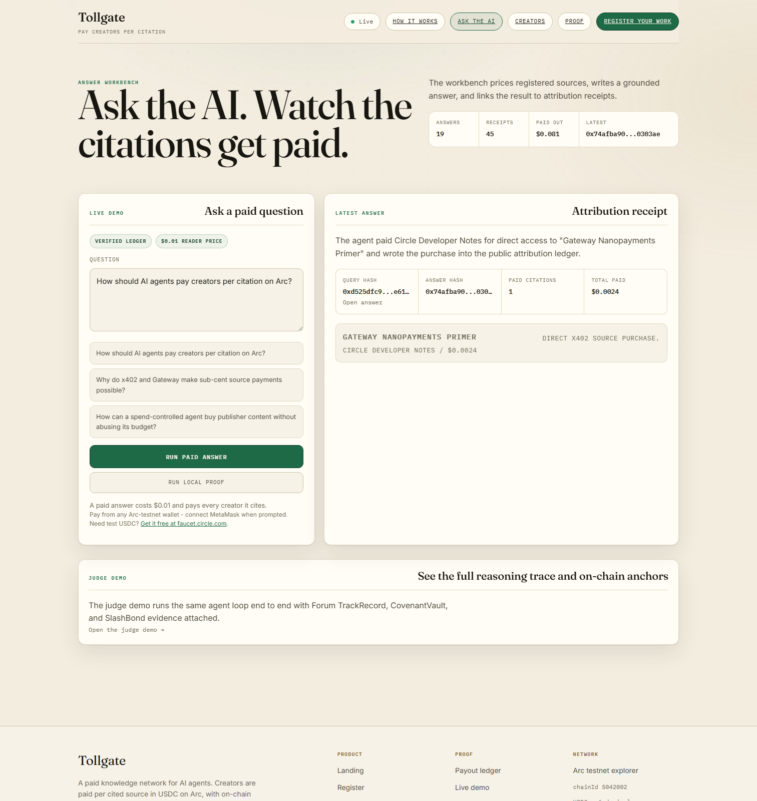

# Tollgate Citations

**AI agents buy evidence. Verified creators get paid only when their work proves useful.**

Tollgate Citations is a source-buying answer agent on Arc testnet. A reader pays
for an answer, the agent appraises priced creator sources, and only supported
claims contribute to creator payouts. The resulting decisions, receipts,
refunds, and signed use intent remain inspectable instead of disappearing inside
the model call.

## Start here

- [Live application](https://tollgate.gudman.xyz/) — HTTP 200 verified on
  2026-07-11.
- [Live proof surface](https://tollgate.gudman.xyz/proof) — HTTP 200 verified on
  2026-07-11.
- [90-second judge flow](docs/JUDGES.md) — the one-click WS5 path and exact
  partial-failure semantics.
- Proof pack route: `/api/judge-proof.json` on a deployment containing WS2+.
- No-secret verifier: `npm run judge:verify -- --url <deployment>`.
- [Public repository](https://github.com/Ridwannurudeen/tollgate).

Deployment boundary: the public branch still points to the pre-roadmap commit
`507abc7`. The public proof-pack URL returned HTTP 404 on 2026-07-11, so no live
proof-pack count is repeated here. The WS1–WS5 judge flow is local work until an
operator deploys it. No public demo-video URL has been verified.



_Tracked product capture from 2026-07-04. Its displayed values are historical
UI fixture/live-state values, not claims about the current deployment._

## Architecture

```text
[Landing-page judge]
          |
 [POST /api/judge-demo]
          |
 [strict-mode + contract preflight]
          |
 [Circle W3S sponsored x402 payment]
          |
 [POST /api/paid-query]
          |
 [judge-strict LLM / fixed five-source buy-skip market]
          |
 [literal-span verification + contribution scoring]
       /                 |                    \
[unused-source]  [FeeRouter creator]  [signed EIP-712 intent]
   [refunds]       [settlement]          [anchored on Arc]
                        |
             [creator balance delta]
                        |
              [hash-linked ledger]
                        |
        [proof pack + 14-check completion gate]
                   /                \
          [stage: complete]   [partial failure + evidence]
```

The sponsored wrapper is presentation plumbing, not traction. The underlying
paid-query route remains the same x402 settlement boundary used by an external
reader or agent.

## Lifecycle

1. `/api/judge-demo` accepts one fixed question and checks that judge-strict
   planning, FeeRouter settlement, and use-intent anchoring are configured.
2. The server-sponsored Circle W3S wallet answers the x402 requirement. Its
   reader payment is classified as operator activity.
3. Judge-strict mode appraises the candidate market and records every buy and
   skip decision. A model failure cannot fall back to a deterministic answer.
4. The claim verifier accepts only literal supporting spans from stored source
   content. Contribution scores allocate the creator pool; unused purchases are
   represented in the refund summary.
5. FeeRouter settlement writes Arc transaction evidence and the sponsored route
   reads each fixed-pool creator's claimable balance before and after the run.
   The signed EIP-712 use intent is prepared before settlement and anchored
   after settlement.
6. The judge route marks `complete` only when all 14 checks pass: strict LLM
   provenance, the exact five-source pool, buy and skip decisions, a supported
   literal span, an unused-source refund, exact x402 reader settlement,
   operator classification, signed and anchored intent evidence, a FeeRouter
   payout, and an internally consistent positive creator balance delta.
7. A missing completion check returns a non-2xx partial failure with a precise
   `stage` and `check`; the paid query, receipts, ledger, reader payment, and any
   `priorFailure` remain in the response and on screen.

## Judge review map

| Review question                           | Evidence                                                                                                                 |
| ----------------------------------------- | ------------------------------------------------------------------------------------------------------------------------ |
| Did an agent make economic choices?       | Recorded model/server mode, bounded budget, and per-source buy/skip decisions.                                           |
| Was the cited work useful?                | Claim-to-literal-span support table, contribution scores, and claim-support root.                                        |
| Did money move under a programmable rule? | x402 reader payment, contribution-weighted FeeRouter payout receipts, and explicit refunds.                              |
| Can a judge verify it without secrets?    | Public ledger/proof pack, local hash-chain recomputation, Arc receipt checks, and `npm run judge:verify`.                |
| Is the decision bound to the spend?       | EIP-712 TollgateUseIntent digest, recovered signer, spend cap, and Arc anchor transaction.                               |
| Is traction presented honestly?           | Operator/fixture/sponsored classes are excluded from independent headline activity; unknown wallets remain unclassified. |
| Is the result reproducible?               | Fixed 50-question corpus and generated result artifacts documented in [the benchmark](docs/BENCHMARK.md).                |

## Run locally

```bash
npm ci
npm test
npm run typecheck
npm run build
npm run dev
```

With a qualifying proof pack served locally, run:

```bash
npm run judge:verify -- --url http://localhost:3000
```

The verifier fetches the proof pack and ledger, recomputes integrity checks,
cross-checks counts, and verifies referenced transactions and contract bytecode
against Arc RPC. It does not read a signing key.

## Core routes

| Route                        | Purpose                                                                           |
| ---------------------------- | --------------------------------------------------------------------------------- |
| `POST /api/judge-demo`       | Configuration-gated, rate-limited sponsored run with an evidence-completion gate. |
| `POST /api/paid-query`       | Multi-accept x402 reader-payment boundary.                                        |
| `POST /api/query`            | Unpaid local-proof answer path.                                                   |
| `GET /api/judge-proof.json`  | Machine-readable judge proof pack when deployed.                                  |
| `GET /api/ledger`            | Public query and receipt ledger.                                                  |
| `GET /api/settlement/status` | Runtime settlement configuration and latest evidence.                             |
| `/answers/<queryId>`         | Full answer, claim, decision, payment, and intent evidence.                       |
| `/proof`                     | Human-readable proof and receipt surface.                                         |

## Arc testnet constants

- chain ID: `5042002`
- RPC: `https://rpc.testnet.arc.network`
- USDC: `0x3600000000000000000000000000000000000000`
- FeeRouter: `0xeff9bc359e8f2a5eabce55af3f1bb24f98eabf59`
- explorer: `https://testnet.arcscan.app`

## Limitations

- The WS1–WS5 branch is not the current public deployment; see
  [post-deadline state](docs/POST_DEADLINE.md).
- The one-click judge run is sponsor-funded operator activity and is excluded
  from independent traction.
- Payments and contracts described here use Arc testnet USDC, not production
  funds.
- The strict demonstration depends on a configured model, funded sponsored
  wallet, enabled FeeRouter, and deployed UseReceiptRegistry. Missing or failed
  dependencies stop visibly at their returned stage.
- The canonical benchmark has measured deterministic policy arms; its full-LLM
  arm remains explicitly unmeasured until a credentialed run is recorded.
- Actor classes are operator-maintained. Unmapped historical wallets remain
  `unclassified`; they are not silently promoted to independent demand.
- No public demo video, submission tag, production audit, or mainnet deployment
  is claimed.

## Experimental and community adapters

These integrations reuse Tollgate settlement ideas but are not evidence that
the Citations WS5 judge path is deployed:

- [Aperture photo licensing](../aperture/README.md)
- [WordPress publisher plugin](../wordpress-plugin-tollgate/README.md)
- [Jellyfin sidecar](../jellyfin-sidecar/README.md)
- [PeerTube plugin](../peertube-plugin-tollgate/README.md)

Built during the Lepton Agents Hackathon continuation. AI usage is documented
in [AI_USAGE.md](AI_USAGE.md).
